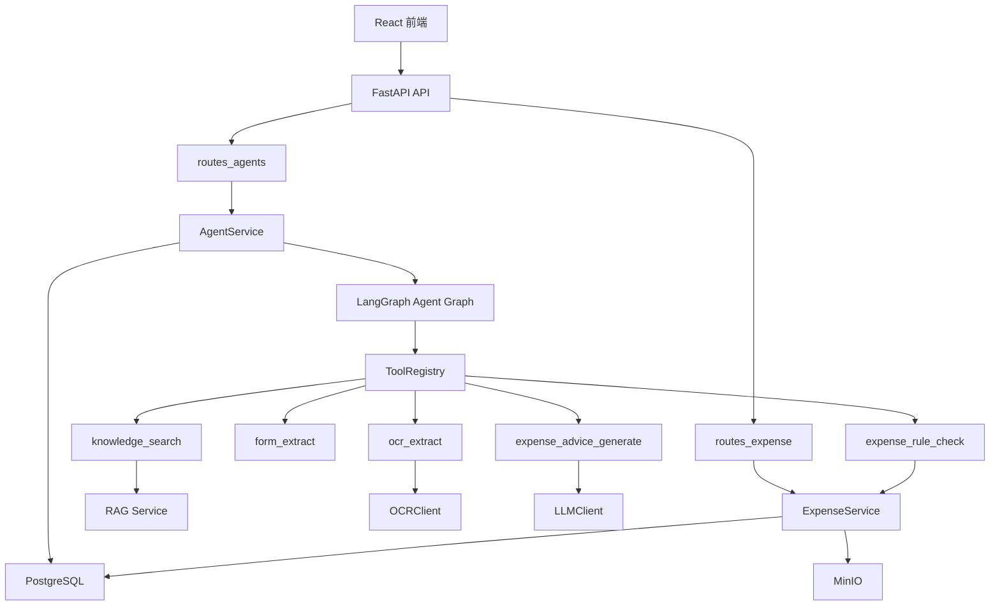
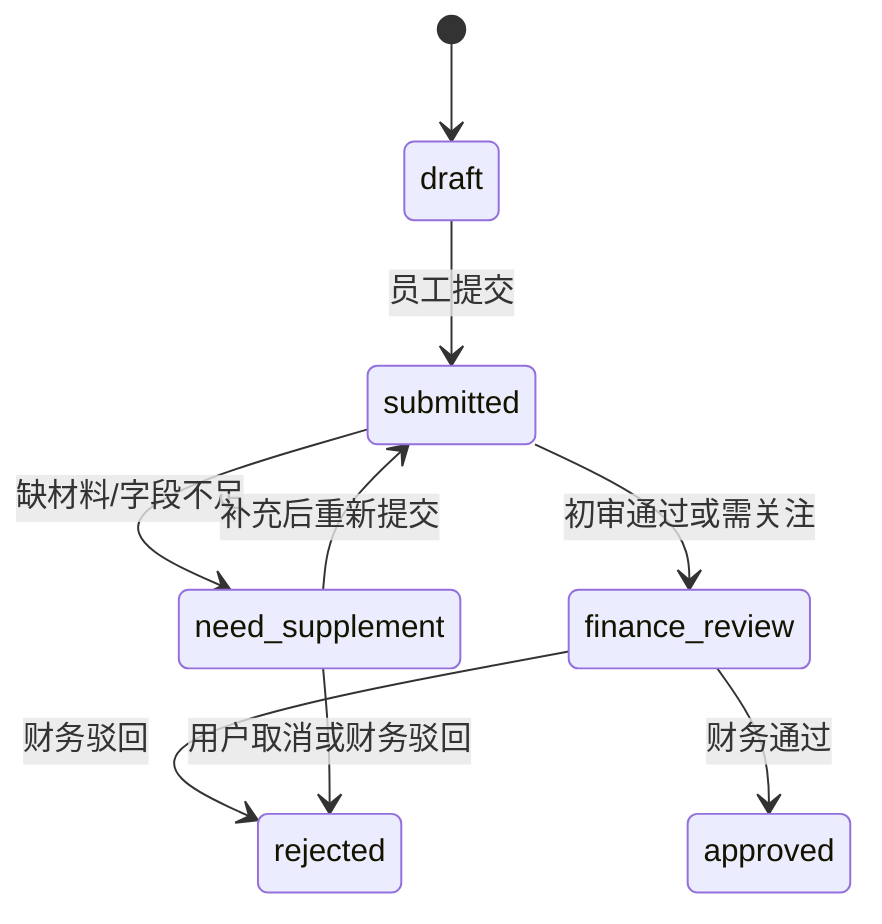
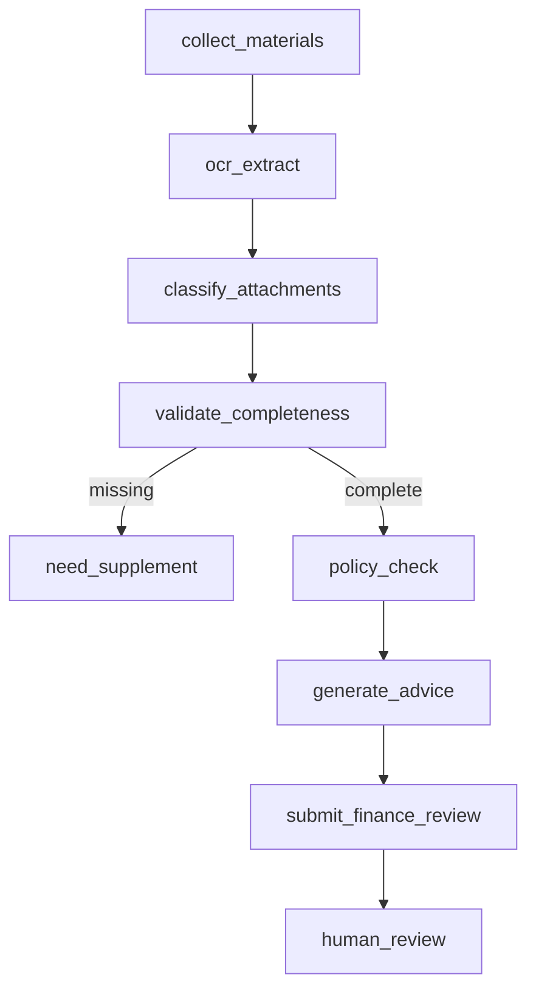

# P6/P7 Agent 框架与报销助手 MVP 研发计划与技术说明

> 审阅稿。本文基于当前代码库现状制定实施方案：先完成可复用的 LangGraph Agent 运行框架，再在其上实现报销助手 MVP 的材料上传、OCR、规则校验、AI 初审和财务复核闭环。

## 1. 目标与边界

### 1.1 P6 目标

- 建立统一 Agent 运行机制：创建 run、推进 graph、记录 step、输出事件流。
- 建立工具注册机制：RAG 检索、表单抽取、OCR、报销规则校验等工具统一封装。
- 支持人工确认节点：当流程需要补充材料或财务复核时暂停，等待用户或财务操作。
- 支持错误恢复：失败步骤可记录原因，后续允许重试或重新执行当前 run。

### 1.2 P7 目标

- 员工可创建报销单并上传发票、水单/支付凭证、审批单等材料。
- 系统可执行 OCR 和附件分类，抽取结构化字段。
- 系统可执行完整性校验、金额校验、抬头校验、日期校验、差旅标准校验。
- 系统生成统一格式的 AI 初审建议。
- 财务角色可查看待办、附件、OCR 字段、风险项，并执行通过、驳回、要求补充。

### 1.3 已确认业务约束

- v0 报销类型只做“差旅报销”。
- 发票抬头的标准公司名称由后台配置维护，不直接写死在 `.env`。
- 差旅金额标准从数据库查询，支持管理员维护。
- OCR 供应商现阶段使用默认实现；后续管理员可在前端配置 OCR 供应商和相关参数。
- 管理员需要可在前端维护系统运行配置，包括 `.env` 中的模型、OCR、RAG 参数、系统提示词等字段。
- 财务审批动作必须记录操作日志表。

### 1.4 本期不纳入

- 对接真实财务付款系统。
- 复杂电子发票真伪查验。
- 企业微信/钉钉/飞书审批流集成。
- 多级审批流配置器。
- 本地训练或部署票据识别模型。
- 完整生产级审计报表。

## 2. 当前代码库现状

### 2.1 已具备基础

- 后端已有 `AgentRun`、`AgentStep` ORM 模型：`backend/app/db/models/agent.py`。
- 后端已有 `ExpenseClaim`、`ExpenseAttachment`、`ExpenseAuditItem` ORM 模型：`backend/app/db/models/expense.py`。
- 后端已有基础枚举：`AgentRunStatus`、`AgentStepStatus`、`ExpenseStatus`、`AuditResult`、`AttachmentType`。
- 后端已有 RAG 服务与会话配置：`backend/app/services/rag_service.py`。
- 前端已有智能体中心页、报销页、财务页占位路由。
- 前端已有通用 `FileUploader` 组件，可作为报销附件上传体验的基础参考。

### 2.2 主要缺口

- `pyproject.toml` 尚未声明 `langgraph` 依赖。
- 缺少 `routes_agents.py`、`routes_expense.py` 并且 `main.py` 未注册相关路由。
- 缺少 `agent_service.py`、`expense_service.py`。
- 缺少 `backend/app/agents/` 下的 state、registry、graph、tool 实现。
- 缺少 OCR 模型适配层 `OCRClient`。
- 报销附件模型当前只有 `file_uri/file_name/file_type/size/attachment_type/ocr_result`，缺少置信度、抽取字段、分类来源等可选元数据，建议复用 JSON 字段或新增字段。
- 报销单模型缺少 `reviewer_id/reviewed_at/review_comment/audit_summary` 等财务复核字段，建议补 migration。
- 缺少财务审批操作日志表，无法审计通过、驳回、要求补充等人工动作。
- 缺少系统配置管理表和管理员配置页面，当前配置主要来自 `.env` 与代码默认值。
- 前端 `ExpensePage` 仅为上传占位，`FinancePage` 需要补待办和详情。

## 3. 总体架构



核心原则：

- API 层只做鉴权、参数校验和响应包装。
- Agent 不直接写数据库，所有业务变更通过 service/tool 完成。
- 工具必须有明确输入输出 schema，便于记录 step 和后续重试。
- 报销规则先用确定性函数实现，AI 只负责解释和汇总建议，不替代规则判定。
- 财务通过/驳回必须由人工操作触发，不由 Agent 自动完成。

## 4. P6 技术方案

### 4.1 目录结构

建议新增：

```text
backend/app/
  api/
    routes_agents.py
  agents/
    state.py
    events.py
    factory.py
    registry.py
    persistence.py
    tools/
      __init__.py
      knowledge_search.py
      form_extract.py
      expense_tools.py
    graphs/
      __init__.py
      expense_graph.py
  services/
    agent_service.py
  schemas/
    agent.py
```

### 4.2 依赖

在 `backend/pyproject.toml` 增加：

```toml
"langgraph>=0.2.0"
```

如果 LangGraph 版本 API 有差异，以实际安装版本为准，封装在 `agents/factory.py` 内，避免业务层直接依赖版本细节。

### 4.3 Agent 状态

`backend/app/agents/state.py`：

```python
from typing import Any, TypedDict


class AgentState(TypedDict, total=False):
    run_id: str
    user_id: str
    agent_type: str
    messages: list[dict[str, Any]]
    collected_fields: dict[str, Any]
    retrieved_context: list[dict[str, Any]]
    tool_results: list[dict[str, Any]]
    risk_items: list[dict[str, Any]]
    human_required: bool
    next_action: str | None
    claim_id: str | None
    error: str | None
```

### 4.4 Run 与 Step 语义

`agent_runs.status`：

- `pending`：已创建，尚未执行。
- `running`：graph 执行中。
- `succeeded`：当前自动化流程完成。
- `failed`：执行异常，需重试或人工处理。
- `cancelled`：用户取消。

`agent_steps.status`：

- `pending`：节点排队。
- `running`：节点执行中。
- `succeeded`：节点成功。
- `failed`：节点失败。
- `skipped`：条件分支未执行。

建议每个节点记录：

- `step_name`
- `input`
- `output`
- `error_message`
- `started_at`
- `completed_at`

### 4.5 Agent API

```http
POST /agents/runs
GET /agents/runs
GET /agents/runs/{run_id}
GET /agents/runs/{run_id}/steps
POST /agents/runs/{run_id}/resume
POST /agents/runs/{run_id}/cancel
GET /agents/runs/{run_id}/events
```

请求示例：

```json
{
  "agent_type": "expense",
  "input": {
    "claim_id": "uuid",
    "message": "请帮我检查这次差旅报销材料"
  }
}
```

事件流建议采用 SSE，结构统一为：

```json
{
  "type": "run_started | step_started | step_completed | human_required | run_completed | error",
  "run_id": "uuid",
  "step_name": "validate_completeness",
  "payload": {}
}
```

### 4.6 ToolRegistry

工具注册结构：

```python
@dataclass
class ToolSpec:
    name: str
    description: str
    input_schema: type[BaseModel]
    output_schema: type[BaseModel]
    handler: Callable[..., Awaitable[BaseModel]]
```

P6 先实现基础工具：

- `knowledge_search`：调用现有 RAG 检索能力，继承当前用户权限。
- `form_extract`：从自然语言消息中抽取字段，v0 可用 LLM 或规则占位。
- `human_confirmation`：生成暂停事件，不自动推进。

P7 增加报销工具：

- `expense_ocr_extract`
- `expense_classify_attachment`
- `expense_validate_completeness`
- `expense_policy_check`
- `expense_generate_advice`

### 4.7 持久化策略

- `AgentService.create_run` 写入 `agent_runs`。
- 每个 graph node 开始前写入 `agent_steps.running`。
- node 成功后更新 step output 和状态。
- node 失败后更新 step error，并将 run 标记为 `failed`。
- `human_required=True` 时 run 保持 `running`，但 `next_action` 指向需要的人工动作，例如 `upload_missing_materials` 或 `finance_review`。

### 4.8 P6 验收标准

- 可以创建 `expense` 类型 Agent run。
- 执行过程中至少产生 3 类事件：run started、step completed、human required/run completed。
- 每个 step 的输入输出可在数据库查询到。
- `knowledge_search` 可调用现有 RAG 检索并遵守知识库权限。
- 节点异常时 run 标记为 failed，错误信息可查询。

## 5. P7 技术方案

### 5.1 报销状态机



与 Agent graph 节点对应：



### 5.2 数据模型调整建议

现有三张表可继续使用，但建议新增字段，避免把关键状态全部塞进 JSON。

`expense_claims` 建议新增：

- `claim_no: String(64), unique nullable`：报销单号。
- `expense_type: String(64), nullable`：v0 固定为 `travel`，后续预留扩展。
- `audit_summary: JSONB, nullable`：AI 初审建议整体结构。
- `reviewer_id: UUID, nullable`：财务复核人。
- `reviewed_at: DateTime, nullable`：财务复核时间。
- `review_comment: Text, nullable`：财务意见。

`expense_attachments` 建议新增：

- `extracted_fields: JSONB, nullable`：结构化字段。
- `ocr_confidence: Numeric(5, 4), nullable`：OCR 置信度。
- `classification_source: String(32), nullable`：user/auto/manual。

新增财务审批操作日志表 `expense_approval_logs`：

```text
id
claim_id
actor_id
action              approve | reject | request_supplement | submit | resubmit
from_status
to_status
comment
snapshot            JSONB，记录操作时的关键 claim/audit 摘要
created_at
```

新增差旅标准配置表 `travel_expense_standards`：

```text
id
name
org_id              可空，为空表示全局默认
city_tier           可空，例如 tier1/tier2/other
daily_limit
single_trip_limit
currency
effective_from
effective_to
is_active
metadata
created_at
updated_at
```

新增系统配置表 `system_settings`：

```text
id
key                 唯一，例如 ocr.provider、rag.top_k、prompt.rag.system
value               JSONB
value_type          string | number | boolean | json | secret
group_name          model | ocr | rag | prompt | expense | security
description
is_secret
is_runtime_editable
updated_by
updated_at
```

说明：

- `.env` 继续作为启动默认配置和密钥兜底来源。
- 管理员前端配置写入 `system_settings`，运行时优先级高于 `.env`。
- 密钥类字段只允许写入和覆盖，不在 API 响应中回显明文。
- 如果希望控制迁移范围，也可第一版先将 `extracted_fields` 和置信度放入 `ocr_result`，但 `audit_summary/reviewer_id/reviewed_at/review_comment`、审批日志表、差旅标准表建议本期补齐。

### 5.3 后端目录结构

建议新增：

```text
backend/app/
  api/
    routes_expense.py
  schemas/
    expense.py
  services/
    expense_service.py
  models_gateway/
    ocr_client.py
  expense/
    rules.py
    advice.py
    classifiers.py
```

### 5.4 Expense API

员工端：

```http
POST /expense/claims
GET /expense/claims
GET /expense/claims/{claim_id}
PATCH /expense/claims/{claim_id}
POST /expense/claims/{claim_id}/attachments
DELETE /expense/claims/{claim_id}/attachments/{attachment_id}
POST /expense/claims/{claim_id}/submit
POST /expense/claims/{claim_id}/run-agent
```

财务端：

```http
GET /expense/finance/tasks
GET /expense/finance/tasks/{claim_id}
POST /expense/finance/tasks/{claim_id}/approve
POST /expense/finance/tasks/{claim_id}/reject
POST /expense/finance/tasks/{claim_id}/request-supplement
GET /expense/claims/{claim_id}/approval-logs
```

权限要求：

- 员工只能访问自己的报销单。
- `admin` 可访问全部报销单。
- `finance` 可访问财务待办和执行审批动作。
- 非本人且非财务/管理员访问报销详情返回 403。

### 5.5 OCRClient 设计

接口：

```python
class OCRClient:
    async def extract(self, file_uri: str, file_type: str) -> dict:
        ...
```

实现：

- `ExternalOCRClient`：调用配置的外部 OCR API。
- `DefaultOCRClient`：现阶段默认实现。无供应商配置时返回可演示的结构化占位结果，便于本地开发和测试。
- `ExternalOCRClient` 后续由管理员配置供应商、API 地址、密钥、超时等参数后启用。

配置建议：

```env
OCR_PROVIDER=external_api
OCR_API_BASE=
OCR_API_KEY=
OCR_TIMEOUT_SECONDS=30
```

运行时配置来源优先级：

1. `system_settings` 管理员配置。
2. `.env` 启动配置。
3. 代码默认值。

OCR 统一输出：

```json
{
  "document_type": "invoice | payment | approval | other",
  "confidence": 0.92,
  "fields": {
    "invoice_title": "公司名称",
    "invoice_amount": 128.5,
    "invoice_date": "2026-05-30",
    "invoice_code": "..."
  },
  "raw_text": "...",
  "raw": {}
}
```

### 5.6 规则引擎

`backend/app/expense/rules.py` 中实现确定性规则：

- `check_required_attachments`
- `check_amount_match`
- `check_invoice_title`
- `check_reimbursable_date`
- `check_travel_amount_limit`

统一输出：

```json
{
  "name": "发票金额校验",
  "result": "pass | attention | risk",
  "evidence": "发票合计 128.50 元，申报金额 128.50 元",
  "code": "amount_match"
}
```

规则配置来源：

- 发票抬头标准公司名称：读取 `system_settings` 中的后台配置，例如 `expense.invoice_title`。
- 可报销日期范围：读取 `system_settings`，例如 `expense.reimbursement_days`。
- 差旅金额标准：读取 `travel_expense_standards`，按组织、城市级别、日期生效范围匹配。
- 未匹配到专属标准时回退到全局默认差旅标准。

v0 只实现差旅报销规则，不开放日常、采购等其他报销类型。

### 5.7 AI 初审建议

AI 初审不是规则来源，而是根据规则结果生成自然语言摘要。

输入：

- 报销单字段。
- 附件 OCR 字段。
- 确定性规则 audit items。
- 可选：通过 `knowledge_search` 检索到的报销制度片段。

输出固定结构：

```json
{
  "level": "pass | attention | risk",
  "summary": "审核建议",
  "missing_materials": [],
  "audit_items": [
    {
      "name": "发票金额校验",
      "result": "pass | attention | risk",
      "evidence": "证据说明"
    }
  ],
  "next_action": "supplement | submit_to_finance | reject"
}
```

兜底策略：

- LLM 不可用时，直接由规则结果生成摘要。
- 任一 `risk` 项存在时，整体 `level=risk`。
- 仅存在 `attention` 时，整体 `level=attention`。
- 全部通过时，整体 `level=pass`。

### 5.8 前端页面设计

`ExpensePage` 员工端：

- 报销单列表：草稿、需补充、待财务复核、已通过、已驳回。
- 新建/编辑报销单表单：标题、说明、金额、币种、类型。
- 附件上传：发票、水单/支付凭证、审批单、其他。
- 材料清单：展示必需材料是否齐全。
- AI 初审结果：level、summary、missing materials、audit items。
- 操作：保存草稿、提交初审、补充材料。

`FinancePage` 财务端：

- 待办列表：申请人、金额、状态、风险等级、提交时间。
- 审批详情：报销信息、附件预览、OCR 字段、规则结果、AI 建议。
- 操作：通过、驳回、要求补充。
- 审批日志：展示提交、重提、通过、驳回、要求补充等操作轨迹。

`AdminPage` 管理配置：

- 系统配置：模型 API、Embedding、Rerank、OCR、RAG 参数、系统提示词。
- 报销配置：标准发票抬头、可报销日期范围。
- 差旅标准：全局/组织/城市级别的每日限额、单次限额、生效时间。
- 密钥类字段：只显示“已配置/未配置”，支持覆盖保存，不回显明文。

建议新增组件：

```text
frontend/src/components/Expense/
  ClaimForm.tsx
  AttachmentChecklist.tsx
  AttachmentUploader.tsx
  AuditSummaryPanel.tsx
  AuditItemsTable.tsx
  FinanceTaskTable.tsx
  AttachmentPreview.tsx
  ApprovalLogTimeline.tsx
  TravelStandardTable.tsx
  SystemSettingsForm.tsx
```

### 5.9 前端 API 封装

新增：

```text
frontend/src/api/agents.ts
frontend/src/api/expense.ts
frontend/src/api/settings.ts
frontend/src/types/agent.ts
frontend/src/types/expense.ts
frontend/src/types/settings.ts
```

关键类型：

```ts
export type ExpenseStatus =
  | "draft"
  | "submitted"
  | "need_supplement"
  | "finance_review"
  | "approved"
  | "rejected";

export type AuditResult = "pass" | "attention" | "risk";
```

## 6. 实施计划

### 阶段 A：P6 基础设施

1. 增加 `langgraph` 依赖。
2. 新增 Agent schema、service、routes，并在 `main.py` 注册。
3. 实现 run 创建、列表、详情、steps 查询。
4. 实现 Agent persistence helper，统一记录 step。
5. 实现 ToolRegistry 与基础工具接口。
6. 实现 SSE 事件结构，先支持同步执行后返回事件，后续可扩展异步队列。
7. 增加 P6 后端测试。

验收：可创建 run，执行一个测试 graph，并查询 run/steps。

### 阶段 B：P6 Expense Graph 骨架

1. 创建 `expense_graph.py`。
2. 实现节点：`collect_materials`、`validate_completeness`、`human_required`。
3. 接入 `expense_claims` 基础读取。
4. 让报销材料不完整时暂停并返回补充提示。

验收：缺材料报销单执行后进入 `need_supplement` 或返回 human required。

### 阶段 C：P7 报销后端

1. 补齐报销 schema 与 service。
2. 增加必要 Alembic migration，包括审批日志表、差旅标准表、系统配置表。
3. 实现报销单 CRUD。
4. 实现附件上传与 MinIO 存储。
5. 实现 OCRClient 与 DefaultOCRClient。
6. 实现附件分类与字段抽取保存。
7. 实现规则校验与 audit items 写入，其中发票抬头从后台配置读取，差旅标准从数据库读取。
8. 实现 AI 初审建议生成和兜底摘要。
9. 实现财务待办和审批动作。
10. 实现审批操作日志写入和查询。
11. 增加报销规则、权限、状态流转、审批日志测试。

验收：后端 API 可完成创建、上传、提交、初审、财务审批闭环。

### 阶段 D：P7 前端员工端

1. 扩展 `ExpensePage` 为报销单工作台。
2. 接入报销单列表与详情。
3. 接入附件上传和材料清单。
4. 展示初审结果、缺漏材料、风险项。
5. 支持提交、补充材料、重新初审。

验收：普通用户可完成一张报销单从草稿到待财务复核。

### 阶段 E：P7 前端财务端

1. 扩展 `FinancePage` 为财务待办列表。
2. 增加审批详情页或详情抽屉。
3. 展示附件预览、OCR 字段、AI 建议和风险项。
4. 接入通过、驳回、要求补充。
5. 展示审批日志时间线。

验收：财务用户可处理待办并改变报销单状态。

### 阶段 E2：管理员配置端

1. 扩展 `AdminPage`，增加系统配置、提示词配置、OCR 配置和差旅标准配置。
2. 实现 `settings.ts` API 封装。
3. 密钥字段采用不可回显输入，只展示配置状态。
4. 保存配置后后端写入 `system_settings`，运行时读取新值。
5. 增加差旅标准 CRUD。

验收：管理员可维护标准发票抬头、差旅金额标准、OCR 默认/供应商配置、系统提示词和主要模型参数。

### 阶段 F：联调与回归

1. 跑后端测试。
2. 跑前端构建。
3. 本地联调完整流程。
4. 检查不同角色的访问权限。
5. 补充 README 或操作说明。

## 7. 测试计划

### 7.1 后端测试

- Agent run 创建、查询、取消。
- Agent step 持久化成功和失败场景。
- ToolRegistry 注册和调用。
- 报销单本人访问与越权访问。
- 财务待办仅 finance/admin 可访问。
- 缺少发票、支付凭证、审批单时返回 `need_supplement`。
- 金额不一致时产生 `risk`。
- 抬头不匹配时产生 `risk` 或 `attention`。
- OCR 不可用时使用 FakeOCR 或标记人工复核。
- 财务通过、驳回、要求补充状态流转正确。
- 财务审批操作写入 `expense_approval_logs`。
- 发票抬头从后台配置读取并参与校验。
- 差旅金额标准从数据库读取并参与校验。
- 管理员可更新系统提示词和 OCR 配置。

### 7.2 前端验证

- 普通用户只看到自己的报销单。
- 普通用户不能访问财务待办操作。
- 财务用户能看到待办列表。
- 附件上传后材料清单状态更新。
- 初审结果的 pass/attention/risk 展示清晰。
- 审批操作后列表状态刷新。

### 7.3 手工验收样例

1. 创建报销单，金额 100 元，不上传附件，提交初审：系统提示缺发票、支付凭证、审批单。
2. 上传发票和支付凭证，不上传审批单：系统要求补充审批单。
3. 上传三类材料，OCR 金额与申报金额一致：进入财务待办，建议通过或关注。
4. OCR 金额 80 元，申报金额 100 元：生成风险项，财务可驳回。
5. 财务要求补充后，员工补充材料并重新提交。

## 8. 风险与控制

| 风险 | 控制措施 |
| --- | --- |
| LangGraph 版本 API 变化 | 集中封装在 `agents/factory.py`，业务层不直接依赖 |
| OCR 识别不稳定 | 默认 OCR 保证可演示，保存原始 OCR 结果和置信度，低置信度强制人工关注 |
| AI 初审幻觉 | 规则结果作为唯一判定来源，LLM 仅生成摘要 |
| 权限越界 | service 层按 user/role 过滤，测试覆盖 403 |
| 报销状态流转混乱 | 所有状态变更集中在 `ExpenseService` |
| 附件大文件或格式异常 | 限制文件大小和 MIME 类型，失败写入明确错误 |
| 外部 OCR/LLM 不可用 | FakeClient + 规则兜底，保证流程可演示 |
| 前端修改 `.env` 类配置带来安全风险 | 使用 `system_settings` 覆盖运行时配置，密钥不回显，配置变更记录更新人和时间 |
| 差旅标准匹配错误 | 标准按组织、城市级别、生效日期匹配，并提供全局默认兜底 |

## 9. 需要审阅确认的问题

1. 差旅金额标准需要包含哪些维度：组织、城市级别、岗位级别、每日限额、单次限额、住宿/交通/餐补分类。
2. 管理员前端可配置的 `.env` 字段清单需要确认，建议先开放模型、OCR、RAG、提示词、报销规则相关字段。
3. 配置变更是否需要单独操作日志表；当前建议 `system_settings` 先记录 `updated_by/updated_at`，后续可扩展 `system_setting_logs`。

## 10. 建议验收标准

P6：

- 可创建 Agent run 并执行 expense graph。
- Agent step 可持久化，失败可查询错误。
- 事件流可被前端消费。
- Agent 可调用 RAG 或报销工具。
- 需要人工处理时流程暂停并返回明确 next action。

P7：

- 员工可创建报销单、上传材料、提交初审。
- OCR 或 FakeOCR 能返回结构化字段并保存。
- 缺材料时系统提示补充。
- 材料完整时生成 audit items 和 AI 初审建议。
- 财务可查看待办、附件、字段、风险项。
- 财务可通过、驳回、要求补充。
- 财务审批操作可在审批日志中追溯。
- 管理员可维护标准发票抬头、差旅金额标准、OCR 配置和系统提示词。
- 普通用户不能访问他人报销单或财务待办。
