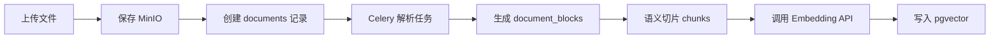
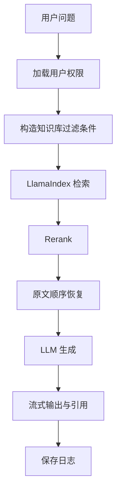
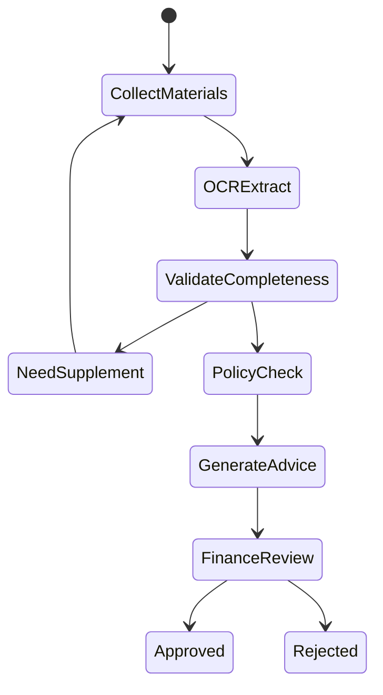
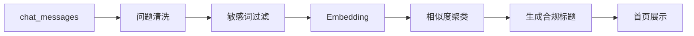
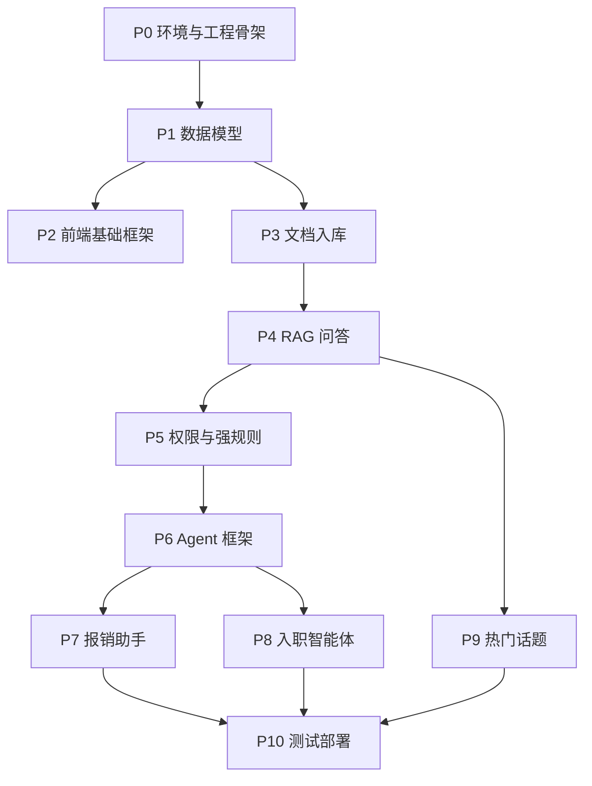

# 智能 Agentic-RAG 平台 v0 开发计划

## 1. 开发原则

v0 阶段目标是做出可运行、可演示、可迭代的完整应用闭环。开发顺序必须先搭建基础工程和可迁移运行环境，再实现知识库与 RAG 核心能力，随后补齐权限、可信机制和业务智能体。

核心原则：

- 本地 Windows 开发，后续 Linux Docker Compose 部署。
- 模型能力先调用外部 API，不在本地部署大模型。
- RAG 使用 LlamaIndex。
- Agent 编排使用 LangGraph。
- 后端采用模块化单体，避免 v0 过早拆微服务。
- 所有模型、OCR、向量库、对象存储能力通过适配层封装，方便后续替换。
- 所有权限过滤必须在后端和数据库查询层生效。

## 2. 阶段总览

| 阶段 | 模块 | 目标产出 |
| --- | --- | --- |
| P0 | 环境与工程骨架 | 本地可启动的前后端、数据库、Redis、MinIO、基础配置 |
| P1 | 基础后端与数据模型 | 用户、组织、角色、知识库、文档、会话、Agent 基础表 |
| P2 | 前端基础框架 | 登录、布局、路由、权限菜单、API 封装 |
| P3 | 知识库与文档入库 | 文档上传、解析、切片、Embedding、pgvector 入库 |
| P4 | LlamaIndex RAG 问答 | 检索、重排、引用、流式回答、问答日志 |
| P5 | 权限隔离与强规则 | 三级知识库权限、SQL 层过滤、强规则原文返回 |
| P6 | LangGraph Agent 框架 | Agent 运行、状态持久化、工具注册、事件流 |
| P7 | 报销助手 MVP | 材料上传、OCR、规则校验、AI 初审、财务复核 |
| P8 | 入职智能体 MVP | 入职问答、清单生成、权限申请指引 |
| P9 | 热门话题与基础看板 | 问题采集、语义去重、敏感过滤、首页展示 |
| P10 | 测试、部署与文档 | 回归测试、Docker 化、Linux 部署说明、评测集 |

## 3. P0 环境与工程骨架

### 3.1 开发目标

完成本地开发基础环境，保证前端、后端、数据库、缓存、对象存储可以独立启动和联调。

### 3.2 环境准备

Windows 本地需要安装：

- Git。
- Node.js 20 LTS。
- Python 3.11。
- Docker Desktop。
- PostgreSQL 客户端工具，可选。
- VS Code 或 PyCharm。

Docker 服务：

- PostgreSQL 16 + pgvector。
- Redis。
- MinIO。

### 3.3 目录结构

```text
RAG_Agent/
  backend/
  frontend/
  deploy/
    docker-compose.dev.yml
    docker-compose.linux.yml
  docs/
  scripts/
  .env.example
  README.md
```

### 3.4 细粒度任务

- 创建后端 FastAPI 工程。
- 创建前端 React + TypeScript + Vite 工程。
- 创建 `docker-compose.dev.yml`。
- 创建 `.env.example`。
- 配置后端 settings：数据库、Redis、MinIO、模型 API。
- 配置基础日志和全局异常处理。
- 配置 Alembic。
- 配置代码格式化：后端 ruff/black，前端 eslint/prettier。

### 3.5 验收标准

- `docker compose` 可启动 PostgreSQL、Redis、MinIO。
- 后端 `/health` 返回正常。
- 前端可打开首页。
- 后端可连接数据库并执行 migration。

## 4. P1 基础后端与数据模型

### 4.1 开发目标

建立核心数据模型和后端分层结构，为后续知识库、RAG、Agent 提供稳定基础。

### 4.2 技术设计

后端采用分层：

```text
api router -> service -> repository/model -> external adapter
```

数据库使用 SQLAlchemy ORM，迁移使用 Alembic。

### 4.3 核心表

- `users`
- `organizations`
- `roles`
- `user_roles`
- `knowledge_bases`
- `kb_acl`
- `documents`
- `document_blocks`
- `chunks`
- `chat_sessions`
- `chat_messages`
- `retrieval_logs`
- `agent_runs`
- `agent_steps`
- `expense_claims`
- `expense_attachments`
- `expense_audit_items`

### 4.4 细粒度任务

- 实现数据库连接和 session 管理。
- 定义用户、组织、角色模型。
- 定义知识库、文档、chunk 模型。
- 定义聊天会话和检索日志模型。
- 定义 Agent 运行和步骤模型。
- 定义报销相关模型。
- 编写初始 Alembic migration。
- 提供 seed 脚本，生成管理员、普通用户、财务用户、示例组织。

### 4.5 验收标准

- migration 可从空库成功创建全部表。
- seed 后可登录不同角色用户。
- 单元测试可覆盖模型创建和基础查询。

## 5. P2 前端基础框架

### 5.1 开发目标

建立前端应用骨架，完成登录、布局、权限菜单和 API 请求封装。

### 5.2 技术设计

- React + TypeScript + Vite。
- Ant Design 作为 UI 基础组件库。
- React Router 管理路由。
- React Query 管理请求缓存。
- Zustand 管理用户和全局状态。

### 5.3 页面范围

- 登录页。
- 首页。
- 知识库管理页。
- 知识问答页。
- 个人空间页。
- 智能体中心页。
- 报销助手页。
- 财务审批页。
- 管理页。

### 5.4 细粒度任务

- 搭建应用布局：顶部栏、侧边栏、内容区。
- 实现登录表单和 token 保存。
- 实现 `/api/me` 用户信息加载。
- 根据用户角色动态生成菜单。
- 封装 API client，统一处理 401、403、500。
- 封装文件上传组件。
- 封装聊天窗口基础组件。
- 封装引用展示组件。

### 5.5 验收标准

- 用户登录后进入首页。
- 不同角色看到不同菜单。
- 退出登录后无法访问受保护页面。
- API 错误有统一提示。

## 6. P3 知识库与文档入库

### 6.1 开发目标

实现用户创建知识库、上传文档、解析文档、切片、向量化并入库。

### 6.2 技术设计

文档入库流程：



v0 文件解析策略：

| 类型 | 解析方式 |
| --- | --- |
| TXT/Markdown | 直接文本解析 |
| Word | python-docx |
| PDF | PyMuPDF，优先文本层 |
| Excel/CSV | pandas/openpyxl |
| 图片/扫描件 | 暂由 OCR API 或报销模块处理 |

### 6.3 后端任务

- 实现知识库 CRUD。
- 实现知识库级别：公司级、部门级、个人级。
- 实现文档上传接口。
- 实现 MinIO 存储适配。
- 实现文档解析器接口 `DocumentParser`。
- 实现不同文件类型 parser。
- 实现 chunker。
- 实现 EmbeddingClient。
- 实现 Celery 文档入库任务。
- 实现文档状态查询接口。

### 6.4 前端任务

- 知识库列表。
- 新建知识库表单。
- 知识库详情页。
- 文档上传组件。
- 入库状态展示：待处理、解析中、向量化中、成功、失败。
- 失败重试按钮。

### 6.5 数据设计

`documents.status`：

- `pending`
- `parsing`
- `chunking`
- `embedding`
- `ready`
- `failed`

`chunks` 必须保存：

- `kb_id`
- `document_id`
- `content`
- `embedding`
- `page_no`
- `block_order`
- `section_path`
- `visibility_scope`
- `org_id`
- `owner_id`
- `is_deterministic_rule`

### 6.6 验收标准

- 可上传 PDF、Word、Markdown、TXT、Excel/CSV。
- 文档解析结果能保存到数据库。
- chunk 向量能写入 pgvector。
- 前端能看到文档处理状态。
- 失败任务可查看原因并重试。

## 7. P4 LlamaIndex RAG 问答

### 7.1 开发目标

实现基于 LlamaIndex 的知识库问答闭环，支持引用、重排、流式输出和问答日志。

### 7.2 技术设计

核心组件：

- `LlamaIndexFactory`：创建索引和检索器。
- `RetrieverService`：执行向量检索和 metadata filter。
- `RerankClient`：调用外部重排模型。
- `CitationBuilder`：生成引用信息。
- `AnswerGenerator`：调用 LLM 输出答案。

问答流程：



### 7.3 后端任务

- 实现 `/api/chat/sessions`。
- 实现 `/api/chat/stream`。
- 接入 LlamaIndex pgvector 检索。
- 接入 RerankClient。
- 实现上下文排序：`document_id + page_no + block_order`。
- 实现 LLMClient 流式输出。
- 保存 `chat_messages`。
- 保存 `retrieval_logs`。

### 7.4 前端任务

- 聊天会话列表。
- 聊天输入框。
- 流式回答展示。
- 引用卡片展示。
- 点击引用查看原文片段。
- 支持选择一个或多个知识库提问。

### 7.5 Prompt 设计

系统提示词约束：

- 只能基于提供的上下文回答。
- 不确定时说明“知识库中未找到明确依据”。
- 关键结论必须附引用。
- 不得编造流程、金额、制度。

### 7.6 验收标准

- 用户可选择知识库提问。
- 回答包含引用来源。
- Rerank 可通过配置开启或关闭。
- 无相关知识时能拒答。
- 检索日志能复盘召回片段和分数。

## 8. P5 权限隔离与强规则可信机制

### 8.1 开发目标

实现公司级、部门级、个人级知识库隔离，并实现强规则内容原文返回，降低幻觉风险。

### 8.2 权限技术设计

检索必须在 SQL 或 LlamaIndex metadata filter 层过滤：

```text
visibility_scope = company
OR visibility_scope = department AND org_id IN current_user_visible_orgs
OR visibility_scope = personal AND owner_id = current_user_id
```

### 8.3 强规则技术设计

强规则命中条件：

- chunk 标记 `is_deterministic_rule = true`。
- 问题命中规则名称、标题、编号或关键词。
- 检索/Rerank 分数超过阈值。

命中后：

- 直接返回 chunk 原文。
- 不调用 LLM 改写。
- 前端标识“原文返回”。

### 8.4 后端任务

- 实现用户可见组织范围计算。
- 实现知识库 ACL 校验。
- 实现 chunk 权限冗余写入。
- 实现检索 metadata filter。
- 实现强规则标记接口。
- 实现 `RuleMatcher`。
- 实现越权访问测试。

### 8.5 前端任务

- 知识库创建时选择级别。
- 部门级知识库选择所属部门。
- 管理员可标记强规则文档或片段。
- 问答页展示“原文返回”状态。

### 8.6 验收标准

- 普通用户不能检索他人个人知识库。
- 非部门成员不能检索部门知识库。
- 强规则问题返回原文，不出现改写。
- 越权请求返回 403 或空结果，不泄露资源内容。

## 9. P6 LangGraph Agent 框架

### 9.1 开发目标

搭建可复用的 Agent 编排框架，为报销助手和入职智能体提供统一运行机制。

### 9.2 技术设计

Agent 由三部分组成：

- Graph：LangGraph 状态机。
- Tools：业务工具函数。
- Persistence：运行状态、步骤和工具结果持久化。

通用状态：

```python
class AgentState(TypedDict):
    run_id: str
    user_id: str
    agent_type: str
    messages: list[dict]
    collected_fields: dict
    retrieved_context: list[dict]
    tool_results: list[dict]
    risk_items: list[dict]
    human_required: bool
    next_action: str | None
```

### 9.3 后端任务

- 实现 `agent_runs` 和 `agent_steps` 写入。
- 实现 AgentFactory。
- 实现 ToolRegistry。
- 实现 Agent 事件流接口。
- 实现 RAG 工具 `knowledge_search`。
- 实现表单抽取工具 `form_extract`。
- 实现人工确认节点。
- 实现 Agent 错误恢复。

### 9.4 前端任务

- 智能体中心页。
- Agent 对话窗口。
- Agent 步骤状态展示。
- 人工确认操作组件。

### 9.5 验收标准

- 可创建 Agent run。
- 每个节点执行结果可持久化。
- 前端能看到 Agent 步骤事件。
- Agent 可调用 RAG 工具。
- 需要人工确认时流程暂停。

## 10. P7 报销助手 MVP

### 10.1 开发目标

实现报销材料收集、OCR 识别、完整性校验、规则校验、AI 初审建议和财务人工复核闭环。

### 10.2 技术设计

状态机：



### 10.3 规则范围

v0 先实现：

- 是否上传发票。
- 是否上传水单或支付凭证。
- 是否上传审批单。
- 发票金额与申报金额是否一致。
- 发票抬头是否符合配置。
- 日期是否在可报销范围内。
- 差旅金额是否超过标准。

### 10.4 后端任务

- 实现报销单 CRUD。
- 实现附件上传。
- 实现 OCRClient。
- 实现附件分类。
- 实现结构化字段抽取。
- 实现规则校验函数。
- 实现 AI 审核建议生成。
- 实现财务待办状态。
- 实现审批通过、驳回、要求补充。

### 10.5 前端任务

- 员工报销申报页。
- 附件上传和材料清单。
- AI 初审结果展示。
- 缺漏材料提示。
- 财务待办列表。
- 财务审批详情页。
- 原始附件预览。
- 风险项列表。
- 通过、驳回、要求补充操作。

### 10.6 输出结构

AI 审核建议统一为：

```json
{
  "level": "pass | attention | risk",
  "summary": "审核建议",
  "missing_materials": [],
  "audit_items": [
    {
      "name": "发票金额校验",
      "result": "pass | attention | risk",
      "evidence": "证据说明"
    }
  ],
  "next_action": "supplement | submit_to_finance | reject"
}
```

### 10.7 验收标准

- 员工可上传报销材料。
- OCR 能返回结构化字段。
- 缺材料时系统提示补充。
- 材料完整时生成 AI 审核建议。
- 财务可查看附件、字段和风险项。
- 财务可人工通过或驳回。

## 11. P8 入职智能体 MVP

### 11.1 开发目标

实现新员工入职相关问答、清单生成和权限申请指引。

### 11.2 技术设计

入职智能体主要调用 RAG 工具和表单抽取工具，不直接执行高风险操作。

流程：

1. 识别用户问题意图。
2. 检索公司级和部门级入职知识库。
3. 输出入职指引、材料清单或权限申请步骤。
4. 对申请类请求收集必要字段。
5. v0 生成待办或申请摘要，不直接对接外部系统。

### 11.3 后端任务

- 实现 onboarding graph。
- 实现入职知识检索工具。
- 实现清单生成节点。
- 实现权限申请字段抽取。
- 实现待办摘要保存。

### 11.4 前端任务

- 入职智能体入口。
- 入职对话页。
- 入职清单展示。
- 权限申请摘要展示。

### 11.5 验收标准

- 可回答入职流程问题。
- 可生成新员工入职清单。
- 可根据岗位/部门给出权限申请指引。
- 回答必须带知识库引用。

## 12. P9 热门话题与基础看板

### 12.1 开发目标

实现首页热门话题的基础版本，支持问题采集、语义去重和敏感过滤。

### 12.2 技术设计

v0 不做复杂 BI，只做离线聚合。

流程：



### 12.3 后端任务

- 保存用户问题事件。
- 配置敏感词表。
- 实现简单语义去重。
- 实现 LLM 生成聚类标题。
- 实现热门话题查询接口。

### 12.4 前端任务

- 首页热门话题列表。
- 话题点击后填入问答框或展示相关问题。
- 管理员敏感词配置基础页面。

### 12.5 验收标准

- 高频问题可聚合为热门话题。
- 隐私、薪资、八卦类问题不展示。
- 个人知识库问题不进入全局首页。

## 13. P10 测试、部署与文档

### 13.1 开发目标

让 v0 可以稳定在 Windows 本地开发，并可部署到 Linux 服务器。

### 13.2 测试计划

后端测试：

- 用户登录与权限。
- 知识库 CRUD。
- 文档上传和入库任务。
- RAG 检索与问答。
- 强规则原文返回。
- Agent 状态流转。
- 报销规则校验。

前端测试：

- 登录流程。
- 知识库管理。
- 文件上传。
- 聊天流式输出。
- 报销审批操作。

RAG 评测集：

- 普通制度问答。
- 表格内容问答。
- 跨段落问答。
- 强规则原文返回。
- 无答案拒答。
- 权限越界问题。

### 13.3 部署任务

- 编写后端 Dockerfile。
- 编写前端 Dockerfile 或 Nginx 静态部署配置。
- 编写 Linux `docker-compose.linux.yml`。
- 编写 `.env.example`。
- 编写数据库备份脚本。
- 编写部署文档。

### 13.4 验收标准

- 新机器按文档可启动完整服务。
- Linux Docker Compose 可运行。
- 核心接口有测试覆盖。
- RAG 评测集可一键运行。

## 14. 推荐开发顺序

严格推荐按以下顺序推进：

1. P0 环境与工程骨架。
2. P1 基础后端与数据模型。
3. P2 前端基础框架。
4. P3 知识库与文档入库。
5. P4 LlamaIndex RAG 问答。
6. P5 权限隔离与强规则可信机制。
7. P6 LangGraph Agent 框架。
8. P7 报销助手 MVP。
9. P8 入职智能体 MVP。
10. P9 热门话题与基础看板。
11. P10 测试、部署与文档。

其中 P3-P5 是整个平台的核心，应优先保证质量。P7 报销助手依赖 P6 Agent 框架和 P4 RAG 能力，不建议提前孤立开发。

## 15. 模块依赖关系



## 16. v0 交付清单

v0 完成后应交付：

- 前端 Web 应用。
- FastAPI 后端服务。
- PostgreSQL + pgvector 数据库迁移。
- Redis + Celery 异步任务。
- MinIO 文件存储。
- LlamaIndex RAG 问答。
- LangGraph Agent 编排。
- 报销助手 MVP。
- 入职智能体 MVP。
- 热门话题基础看板。
- Docker Compose 本地和 Linux 部署配置。
- 开发、部署、测试和 RAG 评测文档。
