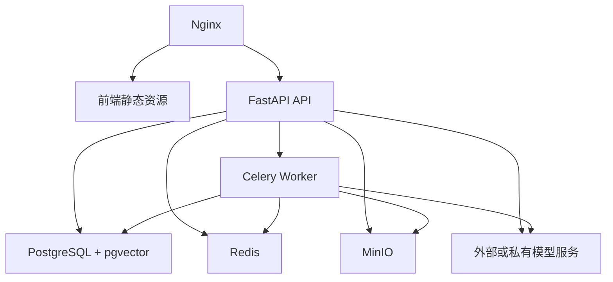
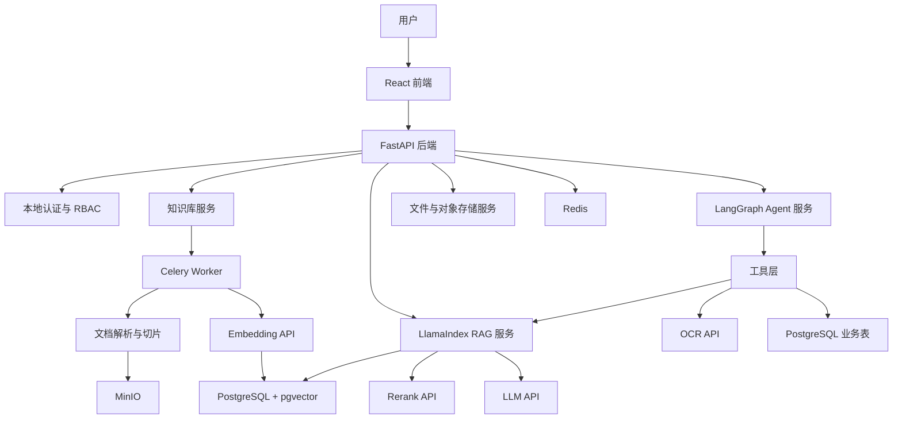
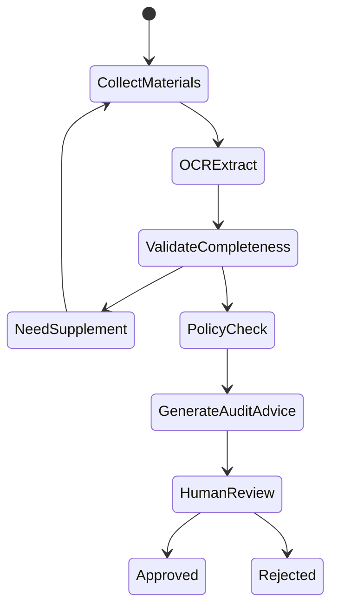

# 智能 Agentic-RAG 平台 v0 版本技术设计

## 1. 设计结论

在当前本地 Windows 开发环境下，v0 阶段直接调用外部模型 API 完成 LLM、Embedding、Rerank、OCR 或多模态识别是合理的。

你的电脑配置为 i5-13500H、16GB RAM、Intel Iris Xe 集显，不适合在本地稳定运行较大的中文 Embedding、Rerank、多模态 OCR 或推理模型。v0 阶段应避免把时间消耗在模型本地部署、显存不足、推理速度和环境兼容问题上，而应优先验证核心业务闭环：

- 文档上传与解析。
- 知识库切片与索引。
- 基于 LlamaIndex 的 RAG 问答。
- 基于 LangGraph 的 Agent 流程编排。
- 权限隔离。
- 报销助手和入职助手的最小可用流程。

模型能力通过统一的模型适配层调用，后续可以平滑替换为本地模型、私有化模型或 Linux 服务器上的模型服务。

## 2. v0 版本目标

v0 不追求一次性实现企业级全量能力，而是实现可演示、可迭代、架构方向正确的最小闭环。

### 2.1 必须实现

- 用户登录的基础版本，可先使用本地账号密码。
- 公司级、部门级、个人级知识库的数据模型和基础权限过滤。
- 文档上传，支持 PDF、Word、Markdown、TXT、Excel/CSV。
- 文档解析、切片、Embedding 入库。
- LlamaIndex 检索问答，支持引用来源。
- Rerank 重排，提升召回准确率。
- 强规则内容原文返回机制。
- LangGraph Agent 编排框架。
- 报销助手的材料上传、OCR 识别、规则校验、AI 初审建议。
- 前端基础页面：知识库管理、问答、个人空间、报销助手。

### 2.2 v0 暂缓实现

- 企业 SSO/OIDC 深度集成。
- Kubernetes 生产部署。
- 完整财务系统打款对接。
- 大规模多租户。
- 自研 OCR、水印去除算法深度优化。
- 模型私有化部署。
- 复杂 BI 看板。

这些能力在 v1 或生产化阶段补齐。

## 3. 本地开发部署形态

### 3.1 推荐本地运行方式

Windows 本机运行：

- 前端：Node.js + Vite。
- 后端：Python + FastAPI。
- Agent/RAG：后端进程内集成 LlamaIndex 和 LangGraph。
- 数据库、缓存、对象存储：Docker Desktop 运行 PostgreSQL、Redis、MinIO。
- 模型：调用外部 API。

本地推荐服务：

| 服务 | v0 选型 | 本地运行方式 |
| --- | --- | --- |
| 前端 | React + TypeScript + Vite | Windows 本机 Node.js |
| 后端 API | FastAPI | Windows 本机 Python |
| RAG | LlamaIndex | 后端 Python 依赖 |
| Agent | LangGraph | 后端 Python 依赖 |
| 数据库 | PostgreSQL + pgvector | Docker Desktop |
| 缓存/任务队列 | Redis | Docker Desktop |
| 对象存储 | MinIO | Docker Desktop |
| 异步任务 | Celery | Windows 本机或 Docker |
| LLM | 外部模型 API | 模型适配层调用 |
| Embedding | 外部 Embedding API | 模型适配层调用 |
| Rerank | 外部 Rerank API | 模型适配层调用 |
| OCR | v0 可用外部 OCR API，或 PaddleOCR 本地轻量版 | 优先 API，必要时本地 |

### 3.2 为什么不建议 v0 本地跑模型

- 16GB 内存对后端、数据库、浏览器、Docker、模型推理同时运行比较紧张。
- Iris Xe 集显不适合承载主流大模型推理。
- Rerank 模型通常比 Embedding 更吃推理资源。
- 多模态 OCR 和票据识别对算力、依赖和调参要求更高。
- 直接调用 API 可以把 v0 精力集中在业务闭环、数据结构和评测体系。

## 4. Linux 部署迁移路径

v0 本地开发时必须遵守“环境可迁移”原则，避免写死 Windows 路径和本机配置。

### 4.1 迁移原则

- 所有配置通过 `.env` 或配置文件注入。
- 文件统一写入 MinIO，不依赖本地绝对路径。
- 数据库迁移使用 Alembic。
- 后端和 Worker 最终都可 Docker 化。
- 模型调用统一走模型适配层，不在业务代码里直接写某个厂商 SDK。
- 前端通过环境变量配置 API 地址。

### 4.2 目标 Linux 部署



v0 可以先用 Docker Compose 部署到 Linux。等访问量、文档规模和团队协作增加后，再迁移 Kubernetes。

## 5. v0 总体架构



## 6. 后端工程结构

建议采用模块化单体，而不是 v0 就拆微服务。这样本地开发成本低，未来仍可按模块拆分。

```text
backend/
  app/
    main.py
    core/
      config.py
      security.py
      logging.py
      exceptions.py
    api/
      routes_auth.py
      routes_kb.py
      routes_documents.py
      routes_chat.py
      routes_agents.py
      routes_expense.py
    db/
      session.py
      models/
      migrations/
    services/
      auth_service.py
      kb_service.py
      document_service.py
      rag_service.py
      agent_service.py
      expense_service.py
    rag/
      llamaindex_factory.py
      retrievers.py
      rerankers.py
      rule_matcher.py
      prompt_templates.py
    agents/
      graph_factory.py
      onboarding_agent.py
      expense_agent.py
      state.py
      tools.py
    models_gateway/
      base.py
      llm_client.py
      embedding_client.py
      rerank_client.py
      ocr_client.py
    workers/
      celery_app.py
      document_tasks.py
      topic_tasks.py
    storage/
      minio_client.py
```

## 7. 前端工程结构

```text
frontend/
  src/
    app/
      router.tsx
      providers.tsx
    pages/
      Login/
      Home/
      KnowledgeBase/
      Chat/
      PersonalSpace/
      Agents/
      Expense/
      Admin/
    components/
      ChatWindow/
      FileUploader/
      CitationPanel/
      KnowledgeBaseSelector/
      ExpenseReviewPanel/
    api/
      auth.ts
      kb.ts
      documents.ts
      chat.ts
      agents.ts
      expense.ts
    stores/
      userStore.ts
      chatStore.ts
    types/
```

## 8. 模型适配层设计

v0 最重要的扩展点是模型适配层。业务代码只能依赖内部接口，不能直接依赖具体模型厂商。

### 8.1 抽象接口

```python
class LLMClient:
    async def chat(self, messages: list[dict], **kwargs) -> str:
        ...

    async def stream_chat(self, messages: list[dict], **kwargs):
        ...

class EmbeddingClient:
    async def embed_texts(self, texts: list[str]) -> list[list[float]]:
        ...

class RerankClient:
    async def rerank(self, query: str, documents: list[str], top_n: int) -> list[int]:
        ...

class OCRClient:
    async def extract(self, file_uri: str, file_type: str) -> dict:
        ...
```

### 8.2 配置示例

```env
MODEL_PROVIDER=openai_compatible
LLM_MODEL=qwen-plus
EMBEDDING_MODEL=text-embedding-v3
RERANK_MODEL=gte-rerank
OCR_PROVIDER=external_api
```

后续迁移时，只需要新增实现：

- `OpenAICompatibleLLMClient`
- `QwenEmbeddingClient`
- `LocalBGEEmbeddingClient`
- `LocalRerankClient`
- `PaddleOCRClient`

业务服务无需改动。

## 9. LlamaIndex RAG 设计

### 9.1 入库流程

1. 上传文件到 MinIO。
2. 写入 `documents` 记录，状态为 `pending`。
3. Celery 执行文档解析。
4. 生成结构化 `document_blocks`。
5. 按标题、段落、表格、页码进行 chunk。
6. 调用 Embedding API。
7. 将 chunk 和向量写入 PostgreSQL + pgvector。
8. 构建或刷新 LlamaIndex 索引元数据。

### 9.2 检索流程

1. 用户选择知识库并提问。
2. 后端计算用户可见范围。
3. LlamaIndex 执行带 metadata filter 的向量检索。
4. 对候选结果调用 Rerank API。
5. 按原文顺序恢复上下文。
6. 判断是否命中强规则原文返回。
7. 未命中强规则时调用 LLM 生成答案。
8. 返回答案、引用、召回片段和置信度。

### 9.3 LlamaIndex 关键封装

- `IndexFactory`：根据知识库创建索引。
- `MetadataFilterBuilder`：构造权限过滤条件。
- `RetrieverService`：统一向量检索、混合检索和重排。
- `CitationBuilder`：构造文档名、页码、段落和原文链接。
- `RuleMatcher`：强规则精确匹配。

## 10. LangGraph Agent 设计

### 10.1 v0 Agent 原则

- Agent 不直接操作数据库，必须通过工具函数。
- 每个工具有明确输入输出 schema。
- 每个节点状态可持久化。
- 高风险操作必须等待人工确认。
- Agent 可以调用 RAG，但 RAG 必须继承当前用户权限。

### 10.2 通用 Agent 状态

```python
class AgentState(TypedDict):
    run_id: str
    user_id: str
    agent_type: str
    messages: list[dict]
    current_intent: str | None
    collected_fields: dict
    retrieved_context: list[dict]
    tool_results: list[dict]
    risk_items: list[dict]
    next_action: str | None
    human_required: bool
```

### 10.3 v0 Agent 类型

| Agent | v0 能力 |
| --- | --- |
| 入职智能体 | 入职问答、材料清单、权限申请指引、生成待办 |
| 报销助手 | 材料收集、OCR 识别、规则校验、缺漏提示、AI 审核建议 |

### 10.4 报销助手节点



## 11. 数据库设计

v0 建议先使用一套 PostgreSQL，业务数据和向量数据同库管理。

### 11.1 核心表

- `users`
- `organizations`
- `roles`
- `user_roles`
- `knowledge_bases`
- `kb_acl`
- `documents`
- `document_blocks`
- `chunks`
- `chat_sessions`
- `chat_messages`
- `retrieval_logs`
- `agent_runs`
- `agent_steps`
- `expense_claims`
- `expense_attachments`
- `expense_audit_items`

### 11.2 chunk 表关键字段

```text
id
kb_id
document_id
content
content_hash
embedding vector
page_no
block_order
section_path
visibility_scope
org_id
owner_id
is_deterministic_rule
rule_name
created_at
```

权限字段冗余在 chunk 上，是为了让检索时直接在 SQL 层过滤。

## 12. 权限设计

v0 使用本地 RBAC：

- `admin`：管理公司级知识库、用户和组织。
- `department_admin`：管理本部门知识库。
- `user`：使用可见知识库，创建个人知识库。
- `finance`：处理报销待办。

检索过滤必须满足：

```text
公司级：所有登录用户可见
部门级：org_id 在用户可见组织范围内
个人级：owner_id 等于当前用户
```

前端菜单根据权限展示，但真正的限制在后端和 SQL 层完成。

## 13. 文档解析策略

v0 采用“先可用，后增强”的策略。

| 文件类型 | v0 方案 | 后续增强 |
| --- | --- | --- |
| Markdown/TXT | 直接读取并按标题切片 | 增加语义切片 |
| Word | python-docx | 保留样式、图片和批注 |
| PDF | PyMuPDF 文本层解析 | 加入复杂版式和水印处理 |
| Excel/CSV | pandas/openpyxl | 表格问答、sheet 级引用 |
| 图片/扫描件 | OCR API | 本地 PaddleOCR 或票据专用模型 |

v0 不建议一开始做复杂水印去除。可以先记录水印问题样本，等 RAG 基线跑通后专项优化。

## 14. 强规则原文返回

强规则机制必须在 v0 做，因为这是系统可信度的核心。

实现方式：

1. 文档入库时允许管理员标记强规则文档或段落。
2. 系统通过标题、编号和关键词自动补充候选规则。
3. 查询时先做精确匹配和高置信检索。
4. 命中后直接返回原文 chunk。
5. 不调用 LLM 总结、改写或润色。

## 15. 可扩展性设计

### 15.1 模型可替换

通过模型适配层支持：

- 云模型 API。
- OpenAI-compatible API。
- 本地模型服务。
- Linux GPU 服务器模型服务。

### 15.2 向量库可替换

v0 使用 pgvector。未来如数据量增长，可迁移：

- Milvus。
- Qdrant。
- Elasticsearch dense vector。

迁移时保留 `VectorStore` 抽象接口。

### 15.3 文档解析可替换

文档解析统一输出内部结构：

```json
{
  "blocks": [
    {
      "type": "text | table | image",
      "content": "...",
      "page_no": 1,
      "block_order": 10,
      "metadata": {}
    }
  ]
}
```

无论底层使用 PyMuPDF、Docling、Unstructured 还是 OCR API，上层切片和 RAG 不变化。

### 15.4 Agent 可扩展

所有 Agent 共用：

- 状态模型。
- 工具注册机制。
- 运行日志。
- 人工介入节点。
- RAG 工具。

新增业务 Agent 时，只新增 graph 和专属工具。

## 16. v0 开发里程碑

### 阶段一：基础工程

- 初始化前后端工程。
- Docker Compose 配置 PostgreSQL、Redis、MinIO。
- FastAPI 项目骨架。
- React 页面骨架。
- Alembic 数据库迁移。

### 阶段二：知识库与 RAG

- 知识库 CRUD。
- 文档上传。
- 文档解析和切片。
- Embedding 入库。
- LlamaIndex 检索问答。
- 引用展示。
- Rerank 接入。

### 阶段三：权限与可信机制

- 本地用户和角色。
- 公司级、部门级、个人级权限。
- 检索 SQL 层权限过滤。
- 强规则原文返回。
- 检索日志和基础评测集。

### 阶段四：Agent MVP

- LangGraph 集成。
- 入职智能体基础问答。
- 报销助手材料上传。
- OCR 识别。
- 规则校验。
- AI 审核建议。
- 财务人工确认页面。

### 阶段五：Linux 部署准备

- 后端 Dockerfile。
- 前端构建和 Nginx 配置。
- Docker Compose Linux 部署脚本。
- `.env.example`。
- 日志、备份和基础监控。

## 17. v0 技术风险与控制

| 风险 | 控制措施 |
| --- | --- |
| 外部模型 API 不稳定 | 模型适配层加超时、重试、错误降级 |
| RAG 召回不准 | 建立小型评测集，调 chunk、top_k、rerank |
| 权限越界 | SQL 层 metadata filter，增加越权测试 |
| 文档解析质量不稳定 | 保存原文和解析产物，支持单文档重跑 |
| OCR 票据识别错误 | 置信度低时强制人工复核 |
| Windows/Linux 环境差异 | 依赖 Docker、环境变量和对象存储，避免本地路径 |
| 后续模型替换成本高 | 所有模型能力通过统一接口调用 |

## 18. 推荐 v0 默认技术栈

最终建议如下：

| 类别 | v0 选择 |
| --- | --- |
| 前端 | React + TypeScript + Vite + Ant Design |
| 后端 | FastAPI + Pydantic + SQLAlchemy + Alembic |
| RAG | LlamaIndex |
| Agent | LangGraph |
| 数据库 | PostgreSQL + pgvector |
| 缓存/队列 | Redis + Celery |
| 对象存储 | MinIO |
| 文档解析 | PyMuPDF + python-docx + pandas/openpyxl |
| OCR | 优先外部 OCR API，后续可切 PaddleOCR |
| LLM/Embedding/Rerank | 外部 API，通过模型适配层封装 |
| 本地运行 | Windows + Docker Desktop |
| 服务器部署 | Linux + Docker Compose，后续 Kubernetes |

## 19. v0 判断标准

v0 成功的标准不是模型完全私有化，而是：

- 能上传文档并完成入库。
- 能按权限检索知识。
- 能给出带引用的答案。
- 强规则能原文返回。
- 报销助手能完成材料识别、缺漏提示和 AI 初审建议。
- 本地 Windows 可开发，Linux 可部署。
- 模型、向量库、OCR、Agent 工具均具备替换空间。
